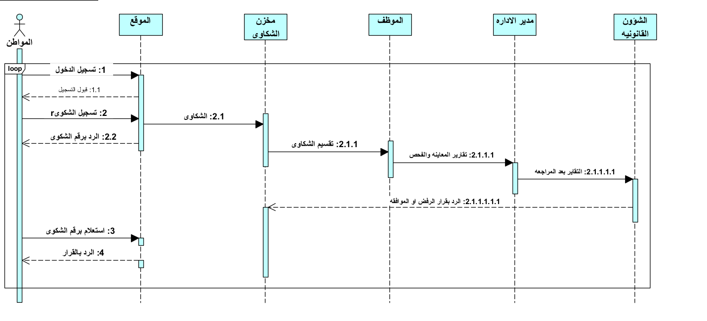

# graduation-project2
Graduation project: A web platform for managing district services, citizen complaints, and building permits.

## مخططات النظام (System Diagrams)

### 1. DFD Level 0 (Context Diagram)

### 2. DFD Level 1

### 3. Use Case Diagram

### 4. Sequence Diagram
