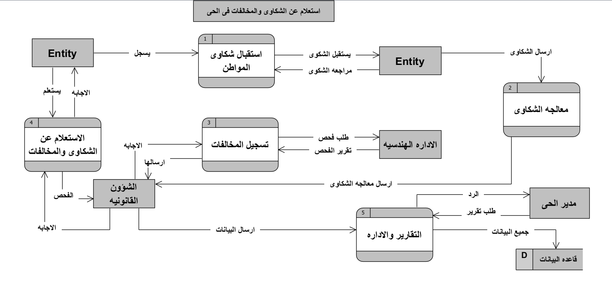

# graduation-project2
مشروع التخرج: منصة إلكترونية لإدارة خدمات الحي، شكاوى المواطنين، وتراخيص البناء.

## مخططات النظام (System Diagrams)

### 1. DFD Level 0 (Context Diagram)

### 2. DFD Level 1

### 3. Use Case Diagram

### 4. Sequence Diagram

### 5. Entity Relationship Diagram (ERD)
